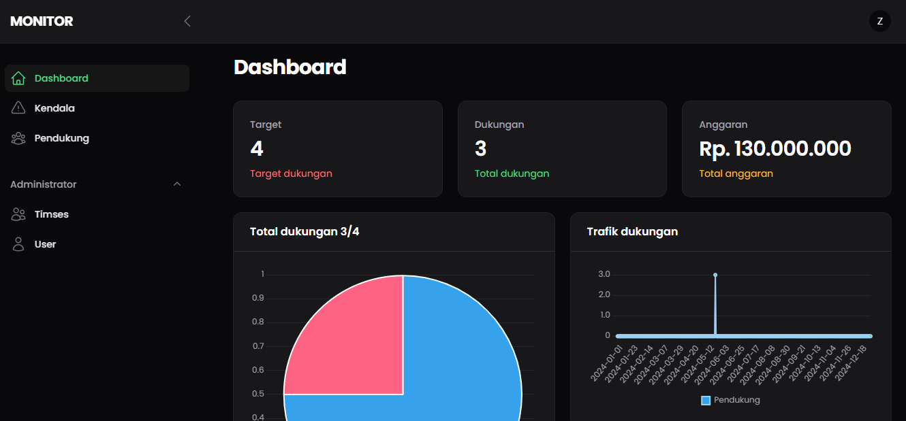

# Aplikasi Monitoring Pemilihan Umum


## Pengenalan

Selamat datang di Aplikasi Monitoring Pemilihan Umum! Aplikasi ini dirancang untuk menyediakan platform komprehensif dalam memantau dan mengelola proses pemilihan umum. analitik yang mendalam, dan antarmuka yang mudah digunakan untuk memastikan transparansi dan efisiensi selama pemilihan umum.

## Fitur

-   **Monitoring:** Melacak hasil pemilihan saat data masuk dari berbagai tempat pemungutan suara.
-   **Analitik Data:** Visualisasi data pemilihan dengan grafik dan chart.
-   **Manajemen Pengguna:** Kontrol akses berbasis peran untuk admin, timses, dan supporter entri data.
-   **Keamanan:** Dibangun dengan fitur keamanan kuat dari Laravel.

## Tangkapan Layar


_Preview grafik pembaruan pemilihan real-time._

## Instalasi

### Prasyarat

-   PHP 8.3x
-   Composer
-   MySQL 8.x

### Langkah-langkah

1. **Clone Repository**

    ```sh
    git clone https://github.com/zaiimrq/monitor.git
    cd monitor
    ```

2. **Install Dependensi**

    ```sh
    composer install
    ```

3. **Setel Variabel Lingkungan**

    - Salin `.env.example` menjadi `.env` dan perbarui konfigurasi sesuai kebutuhan.

    ```sh
    cp .env.example .env
    php artisan key:generate
    ```

4. **Migrasi Database**

    ```sh
    php artisan migrate --seed
    ```

5. **Jalankan Aplikasi**
    ```sh
    php artisan serve
    ```

## Kontak

Untuk pertanyaan lebih lanjut, silakan hubungi [zaiimrq@gmail.com](mailto:zaiimrq@gmail.com).

---

_Selamat memantau dan semoga kandidat terbaik yang menang!_
